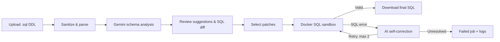
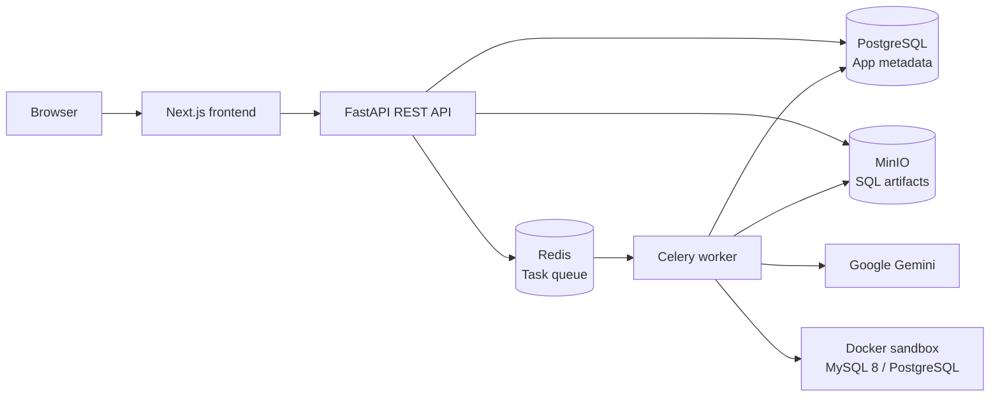

# SQL Optimizer

**AI-assisted MySQL DDL review, with human approval and Docker-based SQL validation.**

> **Undergraduate thesis:** *Rancang Bangun Sistem Optimasi Kinerja DDL MySQL Berbasis API Gemini*  
> **Author:** [Muhammad Alfarizi Habibullah](https://github.com/alfrzhb) · Informatics, UIN Sunan Kalijaga

SQL Optimizer is a web application for examining database schema definitions, proposing structural improvements using Google Gemini, and validating selected SQL changes in a temporary database environment before they are downloaded.

The goal is **a more reviewable schema-improvement workflow**, not autonomous modification of a live database.

**Stack:** Next.js 14 · TypeScript · FastAPI · Python · Google Gemini · SQLGlot · Celery · Redis · PostgreSQL · MinIO · Docker

## The problem

A schema can be syntactically valid while still containing design trade-offs worth reviewing: missing or redundant indexes, potentially expensive column choices, weak constraints, or relationships that are difficult to inspect manually. A developer also needs to assess whether an AI-generated SQL recommendation is appropriate *before* applying it.

This project connects three activities that are often separated:

1. **Understand the structure** of an uploaded DDL file.
2. **Evaluate AI-generated suggestions** with explanations, risk labels, SQL patches, and a visual diff.
3. **Check whether the chosen SQL executes** in a temporary sandbox, with bounded AI-assisted correction if validation fails.

**Research scope:** schema/DDL analysis and validation. The application does **not** benchmark a production workload, prove query-latency improvements, or automatically deploy changes to a user's database.

## How it works



1. **Upload:** An authenticated user chooses a project, a `READ_HEAVY` or `WRITE_HEAVY` context, and a `.sql` file (up to 10 MB). A line-based filter attempts to remove data statements before the file is stored.
2. **Parse:** SQLGlot extracts table and column information for analysis. A separate ERD parser extracts columns and foreign-key relationships for visualization.
3. **Analyze:** Gemini receives a structured schema representation and returns suggestions with an issue description, risk level, confidence score, and proposed SQL patch.
4. **Review:** The user inspects suggestions, selects which to accept, and compares the original and proposed SQL in a diff viewer.
5. **Validate:** A Celery finalization task combines the original DDL with accepted patches and runs it in a disposable Docker database container.
6. **Correct or deliver:** When validation fails, the worker may request up to **two** AI correction attempts. Successful validation produces a downloadable `optimized.sql` artifact; failed attempts are logged.

The final decision to use a suggested schema change remains with the developer.

## Core capabilities

| Capability | What the implementation provides |
| --- | --- |
| Project workspace | Registration/login, JWT authentication, project management, and job history |
| Context-aware analysis | `READ_HEAVY` and `WRITE_HEAVY` inputs for the LLM prompt |
| Structured AI suggestions | Explanation, risk (`LOW` / `MEDIUM` / `HIGH`), confidence, and SQL patch |
| Human-in-the-loop review | Select/reject proposed changes before finalization |
| SQL diff | Side-by-side or inline comparison of original and proposed statements |
| Interactive ERD | React Flow diagram with PK/FK information, table risk indicators, and missing-reference warnings |
| Background processing | Celery jobs with Redis, status polling, and persistent analysis records |
| Sandbox validation | Temporary MySQL or PostgreSQL container selected by dialect |
| Self-correction | At most two LLM correction retries after sandbox SQL errors |
| SQL artifact delivery | Final SQL stored in MinIO and exposed through a time-limited download URL |
| Predictive impact panel | **Heuristic, rule-based estimates** based on suggestions—not measured performance improvements |

### Why MySQL, PostgreSQL, and Docker all appear here

The **thesis focus is MySQL DDL**, and the current analysis prompt is tuned for **MySQL 8**. Choose **MySQL explicitly** in the UI for the intended workflow. The application also exposes a PostgreSQL parsing/validation path, but this is not the primary research target and does not imply dialect-specialized AI recommendations for PostgreSQL.

**PostgreSQL in the application architecture is a separate concern:** it stores users, projects, jobs, suggestions, and metadata. It is *not* the MySQL database being optimized. MySQL 8 is instantiated as a disposable validation target when the selected dialect is MySQL.

## Architecture



| Layer | Technology | Responsibility |
| --- | --- | --- |
| Web | Next.js 14, React 18, TypeScript, Tailwind CSS, Zustand | Project UI, analysis results, diff, job progress |
| Visualization | React Flow, Dagre | Interactive schema and relationship diagrams |
| API | FastAPI, Pydantic, SQLAlchemy, Alembic | Auth, projects, upload, job orchestration, persistence |
| Analysis | SQLGlot, LangChain, Gemini | Schema extraction, structured suggestions, correction prompts |
| Background jobs | Celery, Redis | Long-running analysis and finalization |
| Application database | PostgreSQL 15 | Accounts, jobs, suggestions, audit-related records |
| File storage | MinIO | Uploaded sanitized SQL and finalized SQL artifacts |
| Validation runtime | Docker, MySQL 8 / PostgreSQL 15 | Execute candidate SQL in temporary containers |

The frontend communicates with the API, **not directly with the application database**. The heavy analysis and validation steps are performed outside the HTTP request path.

## Run locally

### Requirements

- Docker Engine / Docker Desktop with Docker Compose
- A Google Gemini API key
- Enough resources to build the frontend and launch temporary database containers

Clone the project:

```bash
git clone https://github.com/alfrzhb/tugas-akhir.git
cd tugas-akhir
cp .env.example .env
```

Edit `.env` before running. In particular:

- Replace `GOOGLE_API_KEY` with your own API key.
- Set a strong `SECRET_KEY` and `FLOWER_PASSWORD`.
- Replace the example PostgreSQL and MinIO passwords for any environment beyond an isolated local demo.
- Do **not** commit `.env`.

Start the services and apply database migrations:

```bash
docker compose up -d --build
docker compose exec api alembic upgrade head
```

| Service | Local address |
| --- | --- |
| Web application | [localhost:3000](http://localhost:3000) |
| API | [localhost:8000](http://localhost:8000) |
| Interactive API docs | [localhost:8000/api/v1/docs](http://localhost:8000/api/v1/docs) |
| Celery Flower | [localhost:5555](http://localhost:5555) |
| MinIO console | [localhost:9001](http://localhost:9001) |

Flower credentials come from `FLOWER_USER` (default `admin`) and `FLOWER_PASSWORD` in `.env`.

Useful development commands:

```bash
docker compose logs -f api worker
docker compose exec api pytest
docker compose down
```

These commands are provided as the repository's local development workflow; they are **not** a claim that a fresh end-to-end run or test pass was verified for this README update.

### Try the user journey

1. Register an account and create a project.
2. Upload a MySQL `.sql` DDL file, select **MySQL** and a workload context.
3. Review the generated findings, risk labels, proposed patches, and ERD.
4. Select the proposals you want to validate; inspect the diff.
5. Finalize the job. Inspect validation results, then download the SQL artifact if it succeeds.

A small input example is available as [`bad_db.sql`](bad_db.sql). Actual Gemini results depend on the input schema, model response, and available API access.

## API and repository guide

The API is exposed under `/api/v1`. Principal endpoint groups:

- `/auth` — register, log in, inspect the current user
- `/projects` — manage project workspaces and list project jobs
- `/jobs/upload` — submit a file for asynchronous analysis
- `/jobs/{job_id}/status` — inspect job state
- `/jobs/{job_id}/suggestions` and `/jobs/{job_id}/schema` — findings and ERD data
- `/jobs/{job_id}/finalize` and `/jobs/{job_id}/download` — validate and retrieve final SQL

See the [API contract](docs/api_contract.md) for request/response details.

```text
frontend/             Next.js pages, state stores, ERD, diff viewer
backend/app/api/      REST routes for auth, projects, and jobs
backend/app/services/ SQL parsing, Gemini, performance estimates, sandbox, storage
backend/app/worker.py Celery analysis and finalization workflows
backend/tests/        API, parser, worker, security, and service tests
docs/                 Product, API, schema, and architecture notes
diagram/              Activity, sequence, use-case, and ERD diagrams
docker-compose.yml    Local multi-service environment
```

Additional design references: [C4 model](07-c4-model-diagram.md) · [component diagram](02-component-diagram.md) · [state machine](04-state-machine-diagram.md) · [functional test scenarios](instrumen_pengujian_fungsional.md).

Some early planning documents retain PostgreSQL-first wording from a prior design iteration. For current runtime behavior, defer to the implementation and the MySQL focus described here.

## Validation, limitations, and security

**SQL runs successfully ≠ schema is proven faster or safe to deploy.** Sandbox execution validates that the assembled SQL can run against a temporary database. It does not reproduce production data volumes, access patterns, index selectivity, migration downtime, or operational risk.

- **Performance estimates are heuristic.** The UI's estimated improvement percentages come from rule-based scoring of suggestions; they are not measured benchmarks.
- **AI output requires review.** A risk label or confidence value is model-generated metadata, not a correctness guarantee. The analysis prompt can request suggestions even for relatively clean schemas.
- **Sanitization has limits.** The upload filter is line-based; it is **not** a complete SQL parser or reliable data-loss-prevention boundary. Do not upload sensitive dumps, secrets, or production data on the assumption that they will be removed.
- **Sandbox privileges matter.** The Compose worker mounts `/var/run/docker.sock`, which grants powerful access to the host Docker daemon. This setup is intended for a trusted local research environment, **not** an internet-exposed or untrusted multi-tenant deployment.
- **The full schema may not be analyzed.** To limit LLM prompt size, schemas with more than 25 tables are sampled.
- **The generated SQL is an artifact for review.** The application does not connect to or automatically migrate a user's production MySQL database.

The repository includes automated test cases under [`backend/tests/`](backend/tests/) and functional testing scenarios in [the test instrument](instrumen_pengujian_fungsional.md). No runtime performance numbers, production-readiness guarantees, or test-pass counts are asserted here without supporting execution evidence.

---

**Built as an Informatics undergraduate thesis** by [Muhammad Alfarizi Habibullah](https://github.com/alfrzhb). See the [personal portfolio](https://alfrzhb.com) for other projects.

*License: No license file is currently included in this repository.*
